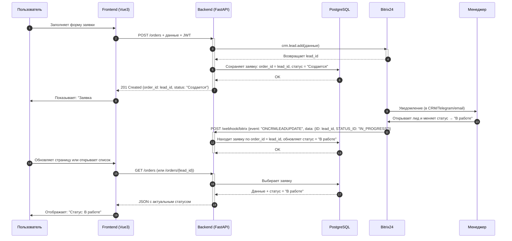

# Manufacturing Frontend (m-front)

**Version:** 3.0.0  
**API Compatibility:** v3.0.0  
**Status:** Production Ready

A Vue 3 + TypeScript + Vite application for manufacturing services with API v3.0.0 compatibility.

## CI/CD (Dev and Prod via tags)

- Production pipeline runs on tags matching `vX.Y.Z` (e.g., `v1.2.3`).
- Development pipeline runs on tags matching `dev-vX.Y.Z` (e.g., `dev-v1.2.3`).
- Build uses BUILD registry for base images and caches; final images are pushed to PUSH registry.
- Deploy writes `.env.production` (VITE_API_BASE, VITE_BASE_PATH) and `.env` with `PUBLIC_HOST` on the remote host.

Required GitLab variables (excerpt):
- Build/Push: `NEXUS_BUILD_REGISTRY`, `NEXUS_BUILD_USER`, `NEXUS_BUILD_PASSWORD`, `NEXUS_PUSH_REGISTRY`, `NEXUS_PUSH_USER`, `NEXUS_PUSH_PASSWORD`.
- Prod deploy: `SSH_HOST` (e.g., 10.33.42.18), `SSH_PORT`, `SSH_USER`, `SSH_PRIVATE_KEY`, `REMOTE_PROJECT_PATH`, `VITE_API_BASE`, `VITE_BASE_PATH`, `PROD_PUBLIC_HOST`.
- Dev deploy: `DEV_SSH_HOST` (e.g., dksv-maas.int.kronshtadt.ru), `DEV_SSH_PORT`, `DEV_SSH_USER`, `DEV_SSH_PRIVATE_KEY`, `DEV_REMOTE_PROJECT_PATH`, `VITE_API_BASE_DEV`, `VITE_BASE_PATH_DEV`, `DEV_PUBLIC_HOST`.

Docker Compose:
- `docker-compose.yml` Traefik rule uses `Host(${PUBLIC_HOST})`. CI deploy populates `.env` with the correct `PUBLIC_HOST` for dev/prod.