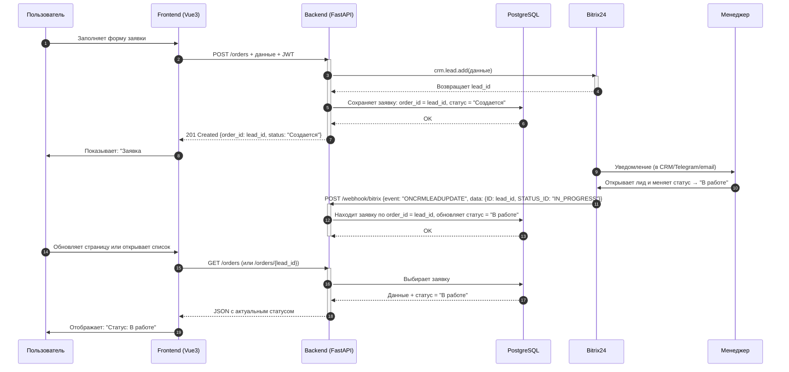

# Vue 3 + TypeScript + Vite

```mermaid
sequenceDiagram
    autonumber
    participant User as Пользователь
    participant FE as Frontend (Vue3)
    participant BE as Backend (FastAPI)
    participant DB as PostgreSQL
    participant BX as Bitrix24
    participant M as Менеджер

    User->>FE: Заполняет форму заявки
    FE->>BE: POST /orders + данные + JWT
    activate BE
    BE->>BX: crm.lead.add(данные)
    activate BX
    BX-->>BE: Возвращает lead_id
    deactivate BX
    BE->>DB: Сохраняет заявку: order_id = lead_id, статус = "Создается"
    DB-->>BE: OK
    BE-->>FE: 201 Created {order_id: lead_id, status: "Создается"}
    deactivate BE
    FE->>User: Показывает: "Заявка #{lead_id} создана. Статус: Создается"

    BX->>M: Уведомление (в CRM/Telegram/email)
    M->>BX: Открывает лид и меняет статус → "В работе"
    BX->>BE: POST /webhook/bitrix {event: "ONCRMLEADUPDATE", data: {ID: lead_id, STATUS_ID: "IN_PROGRESS"}}
    activate BE
    BE->>DB: Находит заявку по order_id = lead_id, обновляет статус = "В работе"
    DB-->>BE: OK
    deactivate BE

    User->>FE: Обновляет страницу или открывает список
    FE->>BE: GET /orders (или /orders/{lead_id})
    activate BE
    BE->>DB: Выбирает заявку
    DB-->>BE: Данные + статус = "В работе"
    BE-->>FE: JSON с актуальным статусом
    deactivate BE
    FE->>User: Отображает: "Статус: В работе"
```
